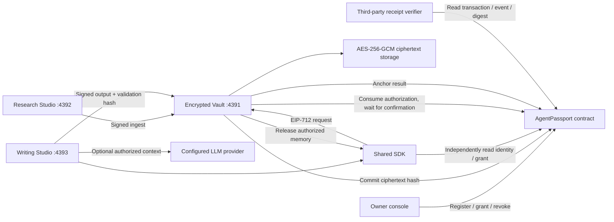

# AgentPassport architecture

## Contract

- Agent: owner, signer, profile commitment, active flag.
- Memory: agent ID, ciphertext commitment, active flag. Commitments are immutable; updates use a new memory ID.
- Grant: Agent ID, application signer, one memory ID, exclusive expiry, remaining reads, revoked flag. A grant cannot be overwritten or un-revoked.
- Access: Grant ID, unique request ID, application-wide nonce, short deadline. Typed domain includes chain ID and contract address.
- Result: request ID already accepted by the contract, output commitment, validation commitment. Only that access's app may attest one result.

OpenZeppelin 5.2 EIP712/ECDSA utilities are pinned to preserve Shanghai-compatible local EVM compilation. Solidity 0.8.30, optimizer 200 runs. No payments, custody transfers or arbitrary external contract calls.

## Read protocol

1. App independently reads Agent and Grant via its configured RPC.
2. SDK verifies application, active Agent, remaining count, expiry and active Memory.
3. App signs `Access(grantId, requestId, nonce, deadline)` using its own key.
4. Vault independently recovers the signer, checks stored ciphertext against the contract's commitment.
5. Vault relays `consume`; the contract authoritatively checks all permissions and replay protection.
6. Vault waits for a successful receipt, decrypts using context-bound AES-GCM, releases memory and receipt.
7. SDK checks that returned fields match its original signed request, then independently checks signature, storage and transaction event.

The Vault remains a trusted plaintext custodian. Chain commitments establish ciphertext integrity, not semantic correctness or cryptographic proof of the decryption returned by a malicious Vault.

## Crypto and persistence

Per-memory random 96-bit IV and 128-bit GCM tag, 256-bit master key. AAD binds chain, contract, Agent, memory ID and category. v1 envelopes contain ciphertext only. Master key is a separate local file excluded from Git. Windows deployments inherit the OS user's file permissions; POSIX file mode alone is not Windows ACL isolation.

JSON commitments use v1 canonical serialization: recursively sorted object keys, array order preserved, JSON primitives. Inputs come from validated schemas; this is a project encoding, not a claim of RFC 8785 conformance. SDK and Vault share the same encoding.

`.data/chain` persists local EVM. State and ciphertext use separate atomic JSON replacements. A serialized relay queue orders Vault writes and resets the relay's cached nonce after failed submissions. On-chain/off-chain writes are not a distributed atomic transaction; a crash after a mined transaction but before local state update can require event reconciliation, which is a production follow-up.

## ERC-8004 relationship

This MVP demonstrates Agent identity and app authorization with a custom contract. It is not an ERC-8004 compliant registry. A future adapter can resolve an existing ERC-8004 registry ID and owner, while the scoped-memory extension supplies the capabilities not provided by identity registration alone. Agent identity is not proof of personhood, capability or invariant model behavior.
